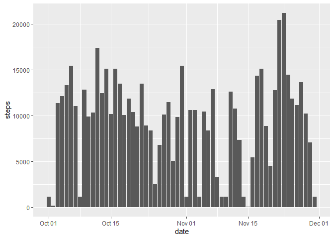
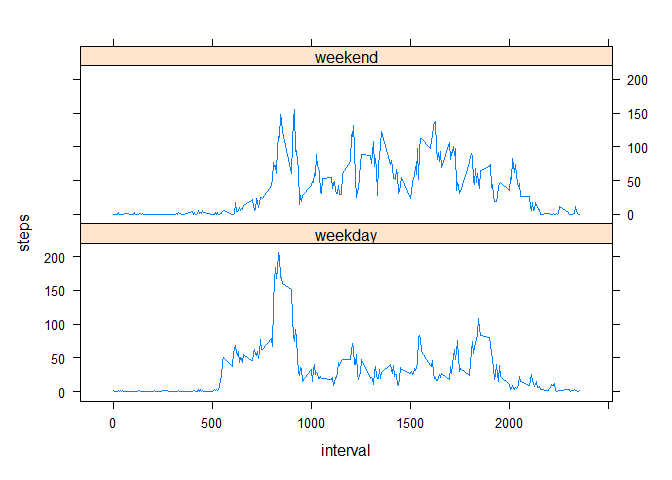

## Loading and preprocessing the data


```r
Sys.setlocale('LC_ALL', 'en_US.UTF-8')
```

```
## [1] "LC_COLLATE=en_US.UTF-8;LC_CTYPE=en_US.UTF-8;LC_MONETARY=en_US.UTF-8;LC_NUMERIC=C;LC_TIME=en_US.UTF-8"
```

```r
activity <- read.csv(unz('activity.zip', 'activity.csv'), sep = ',')
activity$date <- as.Date(activity$date, format = '%Y-%m-%d')
```

## What is mean total number of steps taken per day?


```r
library(dplyr)
```

```
## 
## Attaching package: 'dplyr'
```

```
## The following objects are masked from 'package:stats':
## 
##     filter, lag
```

```
## The following objects are masked from 'package:base':
## 
##     intersect, setdiff, setequal, union
```

```r
activity_bydate <- activity %>%
        group_by(date) %>%
        summarise_all(sum)
library(ggplot2)
g <- ggplot(data = activity_bydate, aes(x = date, y = steps))
g + geom_bar(stat = 'identity')
```

```
## Warning: Removed 8 rows containing missing values (`position_stack()`).
```

<!-- -->

 Mean total number of steps taken per day


```r
mean(activity_bydate$steps, na.rm = TRUE)
```

```
## [1] 10766.19
```

 Median total number of steps taken per day


```r
median(activity_bydate$steps, na.rm = TRUE)
```

```
## [1] 10765
```

## What is the average daily activity pattern?


```r
library(dplyr)
activity_byinterval <- activity %>%
        group_by(interval) %>%
        summarise_all(mean, na.rm = TRUE)
library(ggplot2)
g <- ggplot(data = activity_byinterval, aes(x = interval, y = steps))
g + geom_line()
```

<!-- -->

 Interval with maximum number of steps


```r
list(activity_byinterval[which.max(activity_byinterval$steps),1:2])
```

```
## [[1]]
## # A tibble: 1 × 2
##   interval steps
##      <int> <dbl>
## 1      835  206.
```

## Imputing missing values

 Total number of missing values


```r
sum(is.na(activity))
```

```
## [1] 2304
```

 Filling in all of the missing values in the dataset by the median for that 5-minute interval and creating new dataset


```r
activity_filled_NA <- activity %>%
        group_by(interval)%>%
        mutate(steps = ifelse(is.na(steps), median(steps, na.rm = TRUE), steps))
```

 Histogram of the total number of steps taken each day after imputing missing values


```r
library(dplyr)
activity_bydate_imput <- activity_filled_NA %>%
        group_by(date) %>%
        summarise_all(sum)
library(ggplot2)
g <- ggplot(data = activity_bydate_imput, aes(x = date, y = steps))
g + geom_bar(stat = 'identity')
```

<!-- -->

 Mean total number of steps taken per day after imputing


```r
mean(activity_bydate_imput$steps)
```

```
## [1] 9503.869
```

 Median total number of steps taken per day after imputing


```r
median(activity_bydate_imput$steps)
```

```
## [1] 10395
```

As we can see mean and median numbers after imputing are lover then before.

## Are there differences in activity patterns between weekdays and weekends?


```r
#Create a new factor variable in the dataset with two levels – “weekday” and “weekend”
weekend <- c('Saturday', 'Sunday')
activity_filled_NA <- activity_filled_NA %>%
        mutate(day = weekdays(date)) %>%
        mutate(day = ifelse(day %in% weekend, 'weekend', 'weekday'))
#Make a panel plot
library(dplyr)
activity_byinterval_imput <- activity_filled_NA %>%
        group_by(interval, day) %>%
        summarise_all(mean)
library(lattice)
xyplot(steps ~ interval|day, data = activity_byinterval_imput, type = 'l', layout = c(1,2))
```

<!-- -->

 In the weekend steps are more smoothly distributed.
